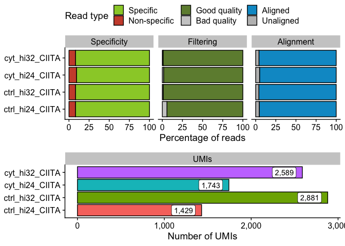
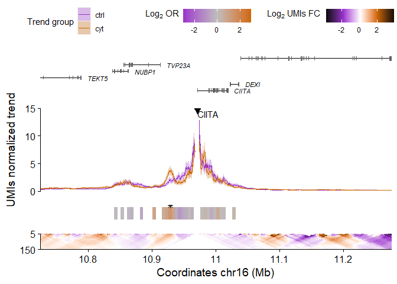

# UMI4Cats 

<!-- badges: start -->
[](https://github.com/Pasquali-lab/UMI4Cats/issues)
[](https://lifecycle.r-lib.org/articles/stages.html#stable)
<!-- badges: end -->

## Bioconductor release status

|      Branch      |    R CMD check   | Last updated |
|:----------------:|:----------------:|:------------:|
| [_devel_](http://bioconductor.org/packages/devel/bioc/html/UMI4Cats.html) | [](http://bioconductor.org/checkResults/devel/bioc-LATEST/UMI4Cats) |  |
| [_release_](http://bioconductor.org/packages/release/bioc/html/UMI4Cats.html) | [](http://bioconductor.org/checkResults/release/bioc-LATEST/UMI4Cats) |  |

The goal of UMI4Cats is to provide and easy-to-use package to analyze
UMI-4C contact data.

## Installation

You can install the latest release of `UMI4Cats` from Bioconductor:

    if (!requireNamespace("BiocManager", quietly = TRUE))
        install.packages("BiocManager")
    
    BiocManager::install("UMI4Cats")


If you want to test the development version, you can install it from the github repository:

    BiocManager::install("Pasquali-lab/UMI4Cats")

Now you can load the package using `library(UMI4Cats)`.

## Basic usage

For detailed instructions on how to use UMI4Cats, please see the [vignette](https://pasquali-lab.github.io/UMI4Cats/articles/UMI4Cats.html).

``` r
library(UMI4Cats)
```

``` r
## 0) Download example data -------------------------------
path <- downloadUMI4CexampleData()

## 1) Generate Digested genome ----------------------------
# The selected RE in this case is DpnII (|GATC), so the cut_pos is 0, and the res_enz "GATC".
hg19_dpnii <- digestGenome(
    cut_pos = 0,
    res_enz = "GATC",
    name_RE = "DpnII",
    ref_gen = BSgenome.Hsapiens.UCSC.hg19::BSgenome.Hsapiens.UCSC.hg19,
    out_path = file.path(tempdir(), "digested_genome/")
)

## 2) Process UMI-4C fastq files --------------------------
raw_dir <- file.path(path, "CIITA", "fastq")

contactsUMI4C(
    fastq_dir = raw_dir,
    wk_dir = file.path(path, "CIITA"),
    bait_seq = "GGACAAGCTCCCTGCAACTCA",
    bait_pad = "GGACTTGCA",
    res_enz = "GATC",
    cut_pos = 0,
    digested_genome = hg19_dpnii,
    bowtie_index = file.path(path, "ref_genome", "ucsc.hg19.chr16"),
    ref_gen = BSgenome.Hsapiens.UCSC.hg19::BSgenome.Hsapiens.UCSC.hg19,
    threads = 5
)

## 3) Get filtering and alignment stats -------------------
statsUMI4C(wk_dir = file.path(path, "CIITA"))
```



``` r
## 4) Analyze UMI-4C results ------------------------------
# Load sample processed file paths
files <- list.files(file.path(path, "CIITA", "count"),
    pattern = "*_counts.tsv",
    full.names = TRUE
)

# Create colData including all relevant information
colData <- data.frame(
    sampleID = gsub("_counts.tsv.gz", "", basename(files)),
    file = files,
    stringsAsFactors = FALSE
)

library(tidyr)
colData <- colData |>
    separate(sampleID,
        into = c("condition", "replicate", "viewpoint"),
        remove = FALSE
    )

# Load UMI-4C data and generate UMI4C object
umi <- makeUMI4C(
    colData = colData,
    viewpoint_name = "CIITA",
    grouping = "condition"
)

## 5) Perform differential test ---------------------------
umi <- fisherUMI4C(umi,
    grouping = "condition",
    filter_low = 20
)

## 6) Plot results ----------------------------------------
plotUMI4C(umi,
    grouping = "condition",
    ylim = c(0, 15),
    xlim = c(10.75e6, 11.25e6)
)
```



## Code of Conduct

Please note that the UMI4Cats project is released with a [Contributor
Code of
Conduct](https://contributor-covenant.org/version/2/0/CODE_OF_CONDUCT.html).
By contributing to this project, you agree to abide by its terms.
