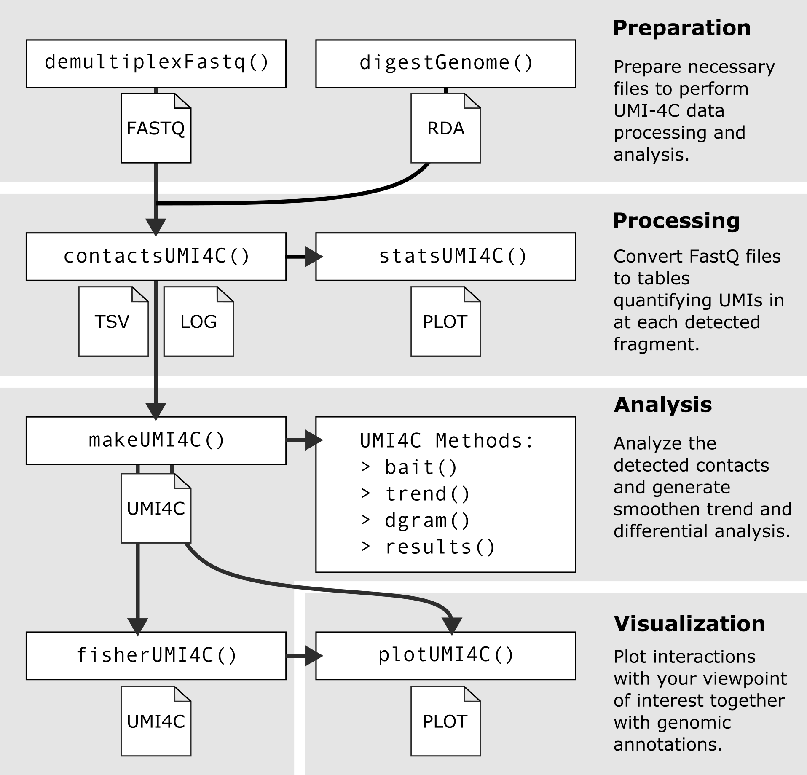

```{r setup, include = FALSE}
knitr::opts_chunk$set(
  collapse = TRUE,
  comment = "#>",
  eval = FALSE,
  warning = FALSE,
  message = FALSE,
  fig.align = "center"
)
```

```{r, echo=FALSE, eval=TRUE, out.width='30%'}
knitr::include_graphics("../man/figures/UMI4Cats.png")
```

# Introduction

Hello stranger! If you are here, that means you've successfully completed the UMI-4C protocol and got some sequencing results! This vignette has the objective to guide you through performing a simple analysis of your brand-new UMI-4C contact data. Let's dive in!

```{r}
library(UMI4Cats)
```

## Overview of the package

```{r, echo=FALSE, eval=TRUE, fig.cap="Overview of the different functions included in the UMI4Cats package to analyze UMI-4C data."}

```

## About the experimental design

One of the streghts of the UMI-4C assay [@Schwartzman2016] is that it allows to recude the PCR duplication bias, thus allowing more accurate quantification of chormatin interactions. For this reason, UMI-4C is mostly used when trying to compare changes in chromatin interactions between two conditions, cell types or developmental stages. 

Taking into account this main application, UMI4Cats has been developed to facilitate the differential analysis between condition at a given viewpoint of interest. When analyzing your data with this package, you should take into account the following points: 

- Each analysis (and `UMI4C` object) should correspond to the **same viewpoint**. If you are analyzing different viewpoints in 
the same or different loci, you need to analyze them separately. 

- The UMI4Cats package is mostly oriented to the performance of differential analysis. For this reason, in the analysis step, it requires to **annotate each sample "replicate" and "condition"**. However, if you only have one replicate or condition you will be able to perform the analysis and visualization of the data -- minus the differential analysis.

- When performing the differential analysis, UMI4Cats is only able to deal with a **condition with 2 different levels**. If you have more than two conditions, you should produce different UMI4C objects with the pairwise comparisons.

## About the example datasets

The datasets used in this vignette are easily available for download if you want to reproduce the contents of this vignette and are published in @Ramos-Rodriguez2019.

Briefly, the datasets correspond to human pancreatic islets exposed (`cyt`) or not (`ctrl`) to pro-inflammatory cytokines for 48 hours. In this example we are using the UMI-4C data generated from two different biological replicates (HI19 and HI22) using the promoter of the *SOCS1* gene as viewpoint.

# Quick start

In this section we summarize a complete analysis using the examples provided in this package. If you are interested to know more in detail the capabilities of the different functions, you can skip to the following sections. 

```{r processing-quick-start, eval=FALSE}
## 0) Download example data -------------------------------
path <- downloadUMI4CexampleData()

## 1) Generate Digested genome ----------------------------
# The selected RE in this case is DpnII (|GATC), so the cs5p is "" and cs3p is GATC
hg19_dpnii <- digestGenome(cut_pos = 0,
                           res_enz = "GATC",
                           name_RE = "DpnII",
                           ref_gen = BSgenome.Hsapiens.UCSC.hg19::BSgenome.Hsapiens.UCSC.hg19, 
                           out_path = "digested_genome/")

## 2) Process UMI-4C fastq files --------------------------
raw_dir <- file.path(path, "SOCS1", "fastq")

contactsUMI4C(fastq_dir = raw_dir,
              wk_dir = "SOCS1",
              bait_seq = "CCCAAATCGCCCAGACCAG",
              bait_pad = "GCGCG",
              res_enz = "GATC",
              cut_pos = 0,
              digested_genome = hg19_dpnii,
              bowtie_index = file.path(path, "ref_genome", "ucsc.hg19.chr16"),
              ref_gen = BSgenome.Hsapiens.UCSC.hg19::BSgenome.Hsapiens.UCSC.hg19,
             threads = 5)
``` 

```{r analysis-quick-start}
## 3) Get filtering and alignment stats -------------------
statsUMI4C(wk_dir = system.file("extdata", "SOCS1",
                               package="UMI4Cats"))

## 4) Analyze the results ---------------------------------
# Load sample processed file paths
files <- list.files(system.file("extdata", "SOCS1", "count", 
                                package="UMI4Cats"),
                    pattern="*_counts.tsv.gz",
                    full.names=TRUE)

# Create colData including all relevant information
colData <- data.frame(sampleID = gsub("_counts.tsv.gz", "", basename(files)),
                      file = files,
                      stringsAsFactors=FALSE)

library(tidyr)
colData <- colData %>% 
  separate(sampleID, 
           into=c("condition", "replicate", "viewpoint"),
           remove=FALSE)

# Load UMI-4C data and generate UMI4C object
umi <- makeUMI4C(colData=colData,
                 viewpoint_name="SOCS1")

## 5) Perform differential test ---------------------------
umi <- fisherUMI4C(umi,
                   filter_low = 20)

## 6)  Plot results ---------------------------------------
plotUMI4C(umi, 
          ylim=c(0,10),
          xlim=c(11e6, 11.5e6)
          )
```


# Preparing necessary files

## Demultiplexing fastQ files containing multiple baits

One of the many advantages of using the UMI-4C protocol is that it allows multiplexing of different baits using the same sample. 

To facilitate the analysis, UMI4Cats  provides a function for demultiplexing the paired-end FastQ files returned by the sequencing facility. The barcode sequences and names to be used for each output sequences need to be provided as a `data.frame` with column names `sample` and `barcode`. 

```{r, eval=FALSE}
barcodes <- data.frame(sample=c("sample1_KLK3", "sample1_KLK6", "sample1_KLK7", "sample1_KLK10"),
                      barcode=c("ATGGTCTGGGCGCTGTCTTG",
                                "TATTCTTCCTCAGCCCACATCTT",
                                "GGATGAAGATTTTGGAGCCCAGC",
                                "GGGCGGGGATTGAACGC"))

demultiplexFastq(barcodes=barcodes,
                fastq="~/samples/sample_1_R1.fastq.gz",
                out_path="raw_fastq")
```

## Reference genome digestion
For the processing of the UMI-4C FastQ files it is necessary to construct a digested genome using the appropriate restriction enzyme. The `UMI4Cats` package includes the `digestGenome()` function to make this process as easy as possible. The function uses a `BSgenome` object^[More information on `BSgenome` package and objects can be found [here](https://bioconductor.org/packages/release/bioc/html/BSgenome.html)] as reference genome and given a cutting sequence for the description enzyme, digests the reference genome.

The cutting position is defined by `cut_pos` a zero-based numeric integrer indicating the nucleotide position where restriction enzyme cuts.

In the following table you can see two examples of the different cutting sequences for *DpnII*, *Csp6I* and *HindIII*.

Restriction enzyme | Restriction seq | cut_pos
-------------------|-----------------|---------
DpnII              | :`GATC`         | 0        
Csp6I              | `G`:`TAC`         | 1    
HindIII            | `A`:`AGCTT`       | 1       

For this example, we are using the hg19 `BSGenome` object and we are going to digest it using *DpnII*. 

```{r}
library(BSgenome.Hsapiens.UCSC.hg19)
refgen <- BSgenome.Hsapiens.UCSC.hg19

hg19_dpnii <- digestGenome(res_enz = "GATC",
                           cut_pos = 0,
                           name_RE = "dpnII",
                           ref_gen = refgen, 
                           sel_chr = "chr16",
                           out_path = "digested_genome/")

hg19_dpnii
```

Additionally, the `digestGenome()` function returns invisibly the path of the generated file, so you can redirect it to a variable (in this case `hg19_dpnii`).

# Processing UMI-4C FASTQ files

This step converts paired-end reads in the FastQ files to UMI counts in the genome fragments generated using the restriction enzymes. The basic function for doing this analysis is `contactsUMI4C()` and should be ran in samples generated with the same viewpoint and restriction enzyme. 

The function will consider all FastQ files in the same folder `fastq_dir` to be part of the same experiment (viewpoint + restriction enzyme). The paired-end FASTQ files in this folder have to have one of the follow extensions: `_RX.fastq`, `_RX.fq`, `_RX.fq.gz` or `_RX.fastq.gz`.

For every experiment analysis, the user needs to define 3 different sequences:

- **Bait/viewpoint sequence** (`bait_seq`). This is the downstream primer sequence (DS primer) that matches the sequence of the queried bait.
- **Padding sequence** (`bait_pad`). The padding sequence corresponds to the nucleotides betweeen the DS primer end and the restriction enzyme site.
- **Restriction enzyme sequence** (`res_enz`). This sequence is the restriction sequence recognized by the selected restriction enzyme.

```{r, echo=FALSE, eval=TRUE, fig.cap="Schematic of a UMI-4C read detailing the different elements that need to be used as input for the processing of the data."}
knitr::include_graphics("figures/read_scheme.png")
```

Additionally, it is necessary to define the restiction enzyme cutting postion (`cut_pos`) in the restriction sequence which corresponds to the site where the restriction enzyme cuts the sequence. For example, for DpnII (`|GATC`) `cut_pos = 0` and for Csp6I (`G|TAC`) `cut_pos = 1`. The function will also need the path for the digested genome (`digested_genome`) generated with the function `digestGenome()`.

As `contactsUMI4C()` performs the alignment using [Bowtie2](http://bowtie-bio.sourceforge.net/bowtie2/index.shtml), you will also need to provide a reference genome in fasta format and the corresponding indexes generated with bowtie2^[See the [getting started section](http://bowtie-bio.sourceforge.net/bowtie2/manual.shtml#getting-started-with-bowtie-2-lambda-phage-example) on the Bowtie2 page for more information on how to generate the index for the reference genome.], which need to be located in the same folder as the fasta file. 

```{r, message=TRUE}
## Download sample dataset
path <- downloadUMI4CexampleData()

# hg19_dpnii <- "digested_genome/BSgenome.Hsapiens.UCSC.hg19_dpnII/"
# path <- "UMI4Cats_data/"

## Processing of fastq files
raw_dir <- file.path(path, "SOCS1", "fastq")

contactsUMI4C(fastq_dir = raw_dir,
              wk_dir = "SOCS1",
              file_pattern="ctrl_hi19_SOCS1", # Select only one sample to reduce time
              bait_seq = "CCCAAATCGCCCAGACCAG",
              bait_pad = "GCGCG",
              res_enz = "GATC",
              cut_pos = 0,
              digested_genome = hg19_dpnii,
              bowtie_index = file.path(path, "ref_genome", "ucsc.hg19.chr16"),
              ref_gen = BSgenome.Hsapiens.UCSC.hg19::BSgenome.Hsapiens.UCSC.hg19,
              threads = 10)

```

`contactsUMI4C()` will run the following processes sequentially:

1. FastQ files preparation (`prepUMI4C`).
2. Split reads at restriction sequences (`splitUMI4C`).
3. Align split reads to the reference genome (`alignmentUMI4C`).
4. Algorithm for collapsing reads coming from same molecule, returning all fragment ends 10Mb around the viewpoint(`counterUMI4C`).

For the preparation and splitting, the FastQ file is loaded into memory. If you are having problems with the memory size, you can change the number of lines to be loaded using the `numb_reads` parameter. See `?contactsUMI4C` for more information.

Finally, the output (UMI-4C counts) is a tsv file saved in `wk_dir/count`. This file will be the input for the data analysis in the following section.

## Quality control measures
Once the contact analysis has been ran, the statistics of the UMI-4C filtering, aligment and final number of UMIs can be generated from the logs generated by the `contactsUMI4C()` function. 

By using these logs, the function `statsUMI4C()` will produce a summary plot  . 

```{r}
statsUMI4C(wk_dir = system.file("extdata", "SOCS1",
                                package="UMI4Cats"))
```

# Analyzing UMI-4C data

For this part of the analysis each bait should be analyzed separately. A different `UMI4C` object should be created for each analyzed bait.

## Construct the `UMI4C` object

The first step of the UMI-4C data analysis consists on loading the tables generated by the function `umi4CatsContacts` and use them to construct a `UMI4C`object. All these steps are perform automatically by the `makeUMI4C` functions. 

The `makeUMI4C` will need as imput a data frame (`colData`) containing all relevant experiment information that will be needed for analyzing the data later on. The mandatory columns that this data frame should have are:

1. `sampleID`: Unique identifier for the sample.
2. `replicate`: Replicate identifier or number.
3. `condition`: Condition for performing the diferential analysis. For example: "control" and "treatment", two different cell types, etc. The condition column should only have **two** different values. If more condition variables are provided, the differential analysis will fail.
4. `file`: Complete path and filename where the tsv files generated by `umi4CatsContacts` are saved.

You can also include additional columns to `colData`, but the ones mentioned above are mandatory.

By default, the function will combine the samples using the **condition** column from `colData(umi)` (the colData data frame you provided for generating the `UMI4C` object), but you can change this behaviour using the `grouping` argument. You can give it one or several column names and will to the grouping based on those variables. For example, if you set `grouping="sampleID"` it will plot the individual profiles.

Additionally, the `makeUMI4C` function also contains other arguments that can be used if you want to tweak the default parameters of the analysis. See `?makeUMI4C` to have a complete list and description of all the arguments.

```{r}
# Load sample processed file paths
files <- list.files(system.file("extdata", "SOCS1", "count", 
                                package = "UMI4Cats"),
                    pattern = "*_counts.tsv",
                    full.names = TRUE)

# Create colData including all relevant information
colData <- data.frame(sampleID = gsub("_counts.tsv.gz", "", basename(files)),
                      file = files,
                      stringsAsFactors = FALSE)

library(tidyr)
colData <- colData %>% 
  separate(sampleID, 
           into = c("condition", "replicate", "viewpoint"),
           remove = FALSE)

# Load UMI-4C data and generate UMI4C object
umi <- makeUMI4C(colData = colData,
                 viewpoint_name = "SOCS1")

umi
```

This function contains several basic steps for preparing and analzying the UMI-4C data:

1. Removing fragment ends around the bait. The default value can be changed using the `bait_exclusion` argument.
2. Focusing the scope of the analysis in a specific region around the bait. The default value can be changed using the `bait_expansion` argument.
3. Obtaining the normalization matrices that will be used to scale the samples to the reference sample. If you want to avoid this normalization step, you can set `normalized` to `FALSE`.
4. Calculating the domainograms for each sample.
5. Calculating the adaptative trend for each sample.

### Accessing information from the `UMI4C` object

The usual accessor functions from the SummarizedExperiment-class also work with the UMI-4C class (for example: `assay`, `colData`, etc.). Other additional accessors have been created to retrieve different information:

- `dgram()`. Get a list of the domaingorams.
- `bait()`. Retrieve a GRanges object with the bait position.
- `trend()`. Obtain a data.frame in long format with the adaptative smoothen trend.
- `results()`. Retrieve results from the differential analysis. This only works if a differential analysis has been performed on the UMI4C object.

```{r}
head(assay(umi))

colData(umi)

dgram(umi)

bait(umi)

head(trend(umi))

results(umi_dif)
```

## Performing differential analysis

Once the `UMI4C` object is generated, one can perform a differential analysis using the `fisherUMI4C()` function. This will take as input the `UMI4C` object. If no other argument is provided, it will bin the region around the viewpoint and perform Fisher's Exact tests in those windows, comparing the number of reads in each condition at that specific window with the number of reads in the studied region. Finally, p-values will be corrected using the FDR method and regions with adjusted p-values > 0.05 will be considered signficantly different. The `filter_low` arguments determines which windows are tested: if they do not contain at least the number of UMIs in `filter_low`, they will not be tested. If you want to disable the filtering you can set `filter_low=FALSE`. You can also change the size of the windows used for this analysis using the `window_size` argument. Check `?fisherUMI4()` for more information.

Additionally, one can select the regions of interest to query for differential contacts using the `query_regions` argument.

Results from this test can be retrieved using the `results()` method defined for `UMI4C` objects.

```{r}
umi_dif <- fisherUMI4C(umi,
                   filter_low=20)

results(umi_dif, ordered=TRUE)
```
 

# Visualizing UMI-4C contact data

Once the `UMI4C` object is created, you can plot it using the `plotUMI4C` function.

```{r}
plotUMI4C(umi)
```

If the `UMI4C` object contains information on the differential contacts, this data will be shown in the plot as well.

```{r}
plotUMI4C(umi_dif)
```

# References

