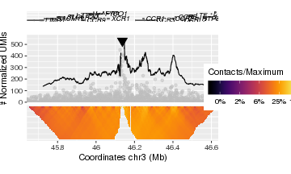

# Introduction
Hello stranger! If you are here, that means you've successfully completed the UMI-4C protocol and got some sequencing results.


```r
library(UMI4Cats)
```


# Quick start

```r
## Processing FASTQ files ----------------------
# TODO: Include quick set of functions for analyzing fastq files

## Analyzing single profiles -------------------
ctrl.proc <- processUMI4C("../data-raw/B0M6_CCR1-5_TFRC_enhUmiRecount.txt",
                          factor=0.01)

plotUMI4C(ctrl.proc,
          ymax=3000, # Maximum UMIs value to plot in y axis
          xlim=c()) # Start and end coordintes to plot

tret.proc <- processUMI4C("../data-raw/B3M6_CCR1-5_TFRC_enhUmiRecount.txt",
                          factor=0.01) # TODO: This file is currently missing!

## Comparison of two profiles ------------------
# 1) Get statistics on differential contacts
differentialContacts(umi4c_obj=treat.proc,
                     ref_umi4c_obj=ctrl.proc,
                     regions=promoters) # TODO: Add some promoters to test

# 2) Obtain a comparison object
comparison <- processComparisonUMI4C(umi4c_obj=treat.proc,
                                     ref_umi4c_obj=ctrl.proc,
                                     factor=0.001)
# 3) Plot the comparison object
plotComparisonUMI4C(comp_obj=comparison,
                    ymax=3000, # Maximum UMIs value to plot in y axis
                    xlim=c(), # Start and end coordintes to plot
                    legend=c("B3M6"="purple", # umi4c_obj label and color
                             "B0M6"="green"), # ref_umi4c_obj label and color
                    highlight="genename") # Name of the gene or genes to highlight 

```


# Processing UMI-4C data


# Analyzing UMI-4C data
Once the processing step is finished, you should end up with a text file containing the following informtion:
- chr bait
- start bait
- chr contact
- start contact
- number of UMIs

This file needs to be loaded into R and then processed

## Analysis of single profiles

The first function one need to use to analyze the processed UMI-4C results in `processUMI4C`. The input of this function can be either a character with the filename where the result of the processing is stored or an already loaded data.frame with that information. 

The input data.frame needs to have 5 columns:

- Bait coordinates (Columns 1:2): `chr` and `start`.
- Contact coordinates (Columns 3:4): `chr` and `start`.
- Number of UMIs supporting the contact (Column 5). 

The `processUMI4C` function will automatically obtain the bait coordinates from the input data.frame. If you want to provide a custom name for the bait that will show in the plot, you need to use the argument `bait_name`.

If for some reason you need to specify custom bait coordinates, you can do so by using the `bait_coordinates` argument. This argument should be a `GRanges` object with the coordinates of the custom bait and one `mcols` element representing the name for the bait (if you want to leave it empty, just add the mcols with value `""`).  


```r
ctrl.proc <- processUMI4C("../data-raw/B0M6_CCR1-5_TFRC_enhUmiRecount.txt",
                          factor=0.01)

plot <- plotUMI4C(ctrl.proc)
#> Registered S3 methods overwritten by 'ggplot2':
#>   method         from 
#>   [.quosures     rlang
#>   c.quosures     rlang
#>   print.quosures rlang
#> Joining, by = c("ensembl_gene_id", "external_gene_name")
#> Warning: Removed 1 rows containing missing values (geom_rect).
#> Warning: Removed 134 rows containing missing values (geom_path).
plot
```




- `processUMI4C`
- `plotUMI4C`

## Comparative analysis of profiles
- `processComparisonUMI4C`
- `plotComparisonUMI4C`
- `differentialContacts`
